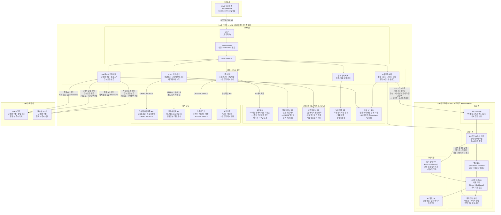
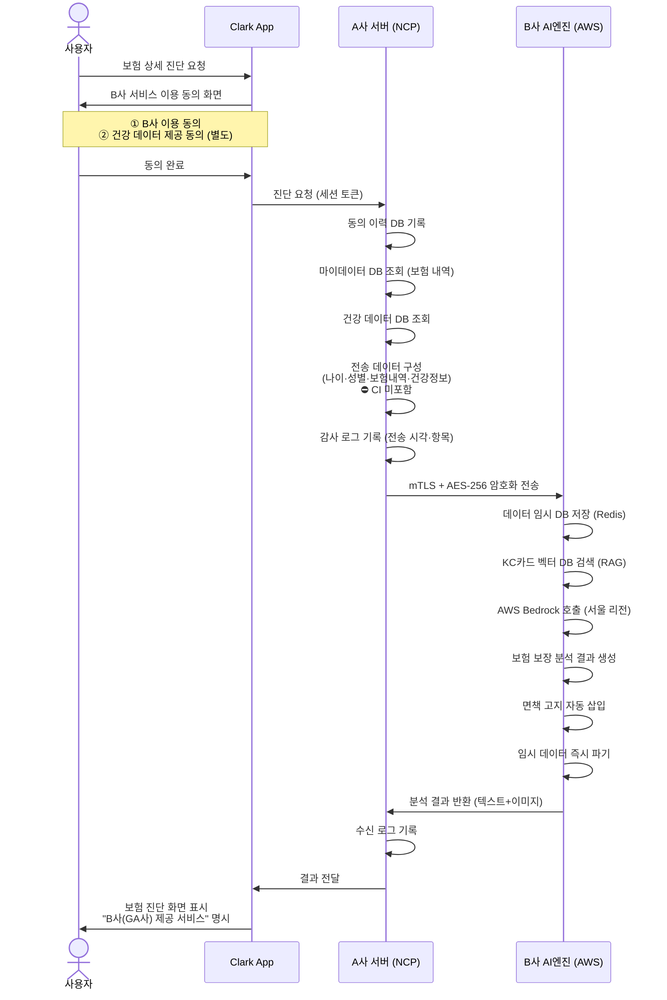
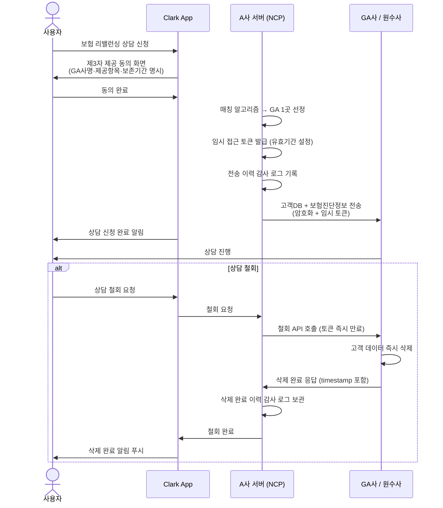
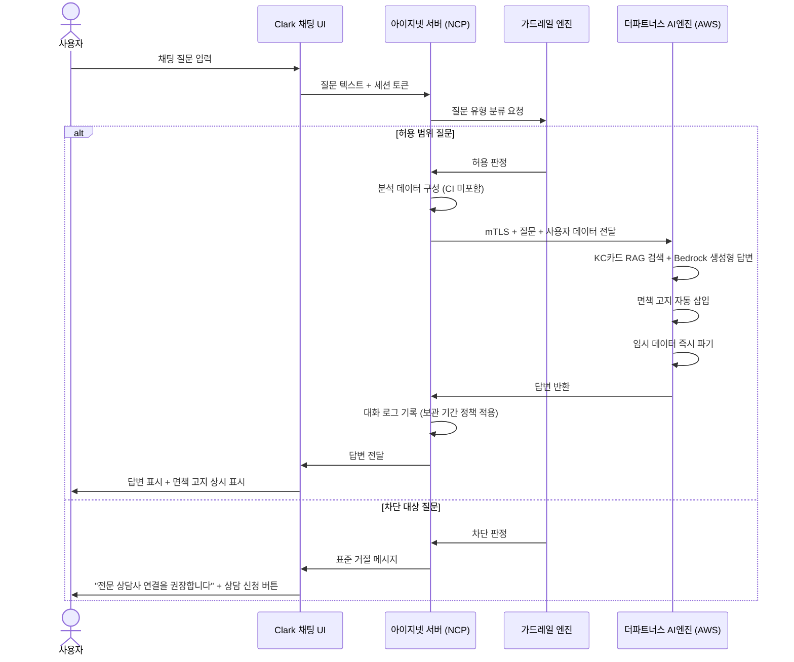

# Clark 시스템 구성도

> 작성 주체: 인프라/아키텍처 에이전트  
> 작성일: 2026-05-14  
> 버전: v4.0  
> A사(NCP) / B사(AWS 서울 리전 + Bedrock)

---

## 1. 전체 시스템 구성도



---

## 2. 망 분리 상세 구성도

```
━━━━━━━━━━━━━━━━━━━━━━━━━━━━━━━━━━━━━━━━━━━━━━━━━━━━━━━
  A사 인프라 (NCP — 네이버 클라우드 플랫폼)
━━━━━━━━━━━━━━━━━━━━━━━━━━━━━━━━━━━━━━━━━━━━━━━━━━━━━━━

  [인터넷 구간]
  사용자 앱 ──── HTTPS / TLS 1.3 ────▶

  ┌─────────────────────────────────────────────┐
  │  DMZ 존                                     │
  │  ┌──────────┐   ┌──────────┐               │
  │  │   WAF    │──▶│ API GW   │               │
  │  │ (방화벽)  │   │Rate Limit│               │
  │  └──────────┘   └────┬─────┘               │
  │                      │                      │
  │               ┌──────▼──────┐               │
  │               │Load Balancer│               │
  └───────────────┴──────┬──────┴───────────────┘
                         │ (사설망 전용)
  ┌──────────────────────▼──────────────────────┐
  │  서비스 존                                   │
  │  ┌──────────┐  ┌──────────┐  ┌───────────┐ │
  │  │ 인증서버  │  │메인서버  │  │동의관리   │ │
  │  │ CI해시생성│  │마이데이터│  │서버       │ │
  │  └──────────┘  └──────────┘  └───────────┘ │
  │  ┌──────────┐  ┌──────────┐               │
  │  │B사연동   │  │GA/원수사 │               │
  │  │서버(CI X)│  │연동서버  │               │
  │  └──────────┘  └──────────┘               │
  └──────────────────┬──────────────────────────┘
                     │ (DB 전용 계정, 최소 권한)
  ┌──────────────────▼──────────────────────────┐
  │  데이터 존 ⚠️ 최고 보안 등급                │
  │  ┌──────────┐  ┌──────────┐  ┌───────────┐ │
  │  │  회원 DB  │  │마이데이터│  │건강데이터 │ │
  │  │CI해시보관│  │   DB     │  │DB (별도 키│ │
  │  │외부미전송│  │AES-256   │  │민감정보)  │ │
  │  └──────────┘  └──────────┘  └───────────┘ │
  │  ┌──────────┐  ┌──────────┐               │
  │  │동의이력  │  │ 감사로그 │               │
  │  │   DB     │  │DB (5년)  │               │
  │  └──────────┘  └──────────┘               │
  └─────────────────────────────────────────────┘

  [A사 → B사 연동 구간]
  mTLS 상호인증 + AES-256 암호화 (인터넷 구간)
  전송 데이터: 나이·성별·보험내역·건강정보
  ⛔ CI 값 미포함

━━━━━━━━━━━━━━━━━━━━━━━━━━━━━━━━━━━━━━━━━━━━━━━━━━━━━━━
  B사 인프라 (AWS 서울 리전 ap-northeast-2)
━━━━━━━━━━━━━━━━━━━━━━━━━━━━━━━━━━━━━━━━━━━━━━━━━━━━━━━

  ┌─────────────────────────────────────────────┐
  │  DMZ 존                                     │
  │  ┌───────────────────────────────────────┐  │
  │  │ API Gateway (A사 전용 mTLS 엔드포인트) │  │
  │  │ 타사 IP 접근 차단                      │  │
  │  └───────────────────┬───────────────────┘  │
  └──────────────────────┼──────────────────────┘
                         │
  ┌──────────────────────▼──────────────────────┐
  │  서비스 존                                   │
  │                                             │
  │  ┌──────────────────────────────────────┐   │
  │  │  KC카드 AI 분석 엔진                  │   │
  │  │  분석 데이터 수신 → RAG 쿼리 생성    │   │
  │  └───────────┬──────────────────────────┘   │
  │              │                              │
  │  ┌───────────▼──────┐  ┌─────────────────┐  │
  │  │  벡터 DB          │  │  AWS Bedrock    │  │
  │  │  OpenSearch       │  │  서울 리전      │  │
  │  │  KC카드 임베딩    │──▶│  Claude 3.5    │  │
  │  └───────────────────┘  │  국외 이전 없음 │  │
  │                         └────────┬────────┘  │
  │                                  │           │
  │  ┌───────────────────────────────▼────────┐  │
  │  │  결과 생성 서버                         │  │
  │  │  텍스트 + 이미지 조합                   │  │
  │  │  면책 고지 자동 삽입                    │  │
  │  └────────────────────────────────────────┘  │
  └──────────────────┬──────────────────────────┘
                     │
  ┌──────────────────▼──────────────────────────┐
  │  데이터 존                                   │
  │  ┌──────────────────┐  ┌──────────────────┐  │
  │  │  KC카드 DB       │  │  임시 분석 DB    │  │
  │  │  보험상품·설계   │  │  Redis (메모리)  │  │
  │  │  영구 보관       │  │  처리 중만 존재  │  │
  │  │  (외부 미전송)   │  │  완료 즉시 파기  │  │
  │  └──────────────────┘  └──────────────────┘  │
  └─────────────────────────────────────────────┘
```

---

## 3. 보험 진단 요청 시퀀스



---

## 4. 상담 신청 및 철회 시퀀스



---

## 5. CI 관리 정책 구성도

```
[사용자 본인인증]
        │
        ▼
  PASS / 아이핀 API
  → CI 원본 수신
        │
        ▼
  A사 인증 서버
  → SHA-256 단방향 해시 생성 (salt 포함)
  → 원본 CI 즉시 폐기
        │
        ▼
  ┌─────────────────────────────────┐
  │  A사 회원 DB                    │
  │  CI 단방향 해시값만 저장        │
  │  목적: 재가입 시 동일인 확인    │
  │  보관: 탈퇴 후 1년              │
  └─────────────────────────────────┘
        │
        │ ⛔ 외부 전송 절대 금지
        │    (B사·GA사·원수사 모두 해당)
        │
  [재가입 시]
  새 CI 해시 생성 → 기존 해시와 대조
  → 동일인 여부만 확인
  → 이중 가입 방지 처리
```

---

## 6. 인프라 컴포넌트 명세

### A사 (NCP)

| 컴포넌트 | NCP 서비스 | 역할 | 비고 |
|---------|----------|------|------|
| WAF | NCP WAF | SQL Injection · XSS 방어 | DMZ 최전선 |
| API Gateway | NCP API Gateway | 인증 · Rate Limit · 라우팅 | JWT 검증 |
| Load Balancer | NCP Load Balancer | 트래픽 분산 · 헬스체크 | |
| 앱 서버 | NCP Server (VPC) | 서비스 로직 전체 | 사설망 |
| 회원 DB | NCP Cloud DB (MySQL) | 회원 정보 · CI 해시 | 컬럼 암호화 |
| 마이데이터 DB | NCP Cloud DB (PostgreSQL) | 보험 내역 | AES-256 |
| 건강 데이터 DB | NCP Cloud DB (PostgreSQL) | 건강 정보 | 별도 암호화 키 |
| 동의·감사 DB | NCP Cloud DB (MySQL) | 동의 이력 · 감사 로그 | 5년 보관 |
| 모니터링 | NCP Cloud Insight | 장애 감지 · 알림 | |
| 보안 모니터링 | NCP Security Monitoring | 이상 접근 탐지 | |

### B사 (AWS 서울 리전)

| 컴포넌트 | AWS 서비스 | 역할 | 비고 |
|---------|----------|------|------|
| API Gateway | AWS API Gateway | A사 전용 mTLS 엔드포인트 | 타사 IP 차단 |
| AI 분석 서버 | EC2 (서울 리전) | KC카드 엔진 · RAG 로직 | |
| LLM | AWS Bedrock (서울) | Claude 3.5 / Llama 3 추론 | 국외 이전 없음 |
| 벡터 DB | OpenSearch Serverless | KC카드 임베딩 저장 · 검색 | |
| KC카드 DB | RDS (PostgreSQL, 서울) | 보험 상품 · 설계 데이터 | 암호화 at-rest |
| 임시 분석 DB | ElastiCache (Redis) | 처리 중 임시 저장 | 완료 즉시 파기 |
| 모니터링 | CloudWatch | 성능 · 장애 모니터링 | |

---

## 7. 보안 정책 요약

| 구간 | 방식 | 기준 |
|------|------|------|
| 사용자 ↔ A사 | TLS 1.3 + Certificate Pinning | 금융보안원 기준 |
| A사 DMZ 내부 | WAF → API GW → LB 순차 통과 | |
| A사 서비스 ↔ DB | 사설망 · 최소 권한 계정 · 컬럼 암호화 | AES-256 |
| A사 ↔ B사 | mTLS 상호인증 + AES-256 + CI 미전송 | |
| A사 ↔ GA/원수사 | TLS + 임시 접근 토큰 (유효기간) | 철회 시 토큰 즉시 만료 |
| B사 Bedrock 호출 | AWS 내부 VPC 통신 (서울 리전) | 국외 이전 없음 |
| CI 값 | A사 내부 단방향 해시만 보관 | 외부 전송 절대 금지 |
| 건강 데이터 | 별도 암호화 키 · 별도 동의 후 처리 | 민감정보 분리 |
| 임시 분석 데이터 | 분석 완료 즉시 파기 (Redis TTL) | B사 장기 보관 금지 |
| 감사 로그 | 전송·접근·삭제 이력 전체 기록 | 5년 보관 |

---

## 8. 채팅 AI 대화 흐름 — 가드레일 적용

### 핵심 리스크

채팅 UI에서는 사용자가 어떤 질문이든 입력 가능하므로, 가드레일 없이 생성형 AI가 자유롭게 답변하면 서비스 범위를 벗어난 답변이 생성될 수 있음.

| 차단 대상 | 법적 리스크 |
|----------|-----------|
| 상품 추천 ("어떤 보험 들면 좋아요?") | 보험업법·금소법 저촉 |
| 보험 비교 ("OO vs XX 비교해줘") | 서비스 범위 외 |
| 가입 권유 ("갈아타는 게 낫나요?") | 보험 권유 행위 경계 모호 |
| AI 잘못된 정보 생성 | 금소법 설명의무 위반 가능 |

### 질문 유형별 처리 방침

| 질문 예시 | 분류 | 처리 |
|---------|------|------|
| "내 보험 보장이 어떻게 돼요?" | ✅ 허용 | KC카드 RAG 기반 보장 현황 분석 |
| "보장 공백이 어디 있나요?" | ✅ 허용 | 현재 가입 내역 기반 공백 안내 |
| "실손 청구는 어떻게 해요?" | ✅ 허용 | 일반 정보 안내 + 면책 고지 |
| "어떤 보험 들면 좋아요?" | 🚫 차단 | 전문 상담사 연결 유도 |
| "OO vs XX 비교해줘" | 🚫 차단 | 전문 상담사 연결 유도 |
| "지금 해지하고 갈아타야 할까요?" | 🚫 차단 | 전문 상담사 연결 유도 |

### 채팅 흐름 시퀀스



### 채팅 대화 로그 관리 정책

| 항목 | 기준 |
|------|------|
| 분류 | 개인정보 (개인 식별 정보와 결합 가능) |
| 더파트너스 보관 | 분석 완료 즉시 파기 (장기 보관 금지) |
| 아이지넷 보관 | 보관 기간·파기 정책 별도 수립 → 개인정보처리방침 반영 |
| 사용자 권리 | 대화 이력 삭제 기능 제공 권장 |

### 면책 고지 표시 기준

- 모든 AI 답변 하단에 면책 고지 상시 표시
- 채팅 UI 상단에 "AI 서비스 / 더파트너스(GA사) 제공" 명시
- 가드레일 차단 시 상담사 연결 CTA 버튼 노출
- 면책 고지 최종 문구: 법무팀 확정 필요

---

## 변경 이력

| 버전 | 날짜 | 내용 |
|------|------|------|
| v1.0 | 2026-05-14 오전 | 최초 작성 — 기본 A/B 분리 구조 |
| v2.0 | 2026-05-14 오후 | AWS Bedrock 확정, CI 정책 반영, 시퀀스 다이어그램 추가 |
| v4.0 | 2026-05-14 | 채팅 AI 대화 흐름 추가 — 가드레일·면책 고지·대화 로그 관리 정책 반영 |
